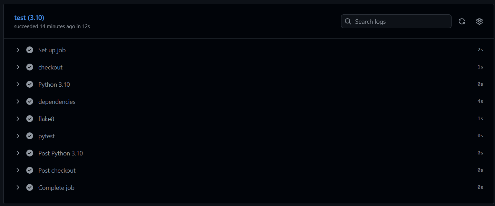
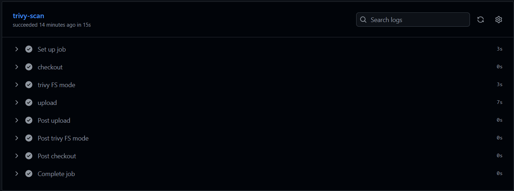
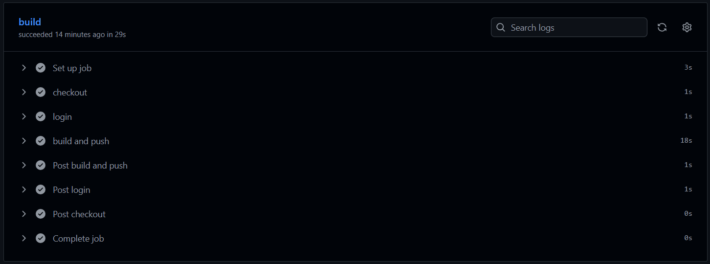
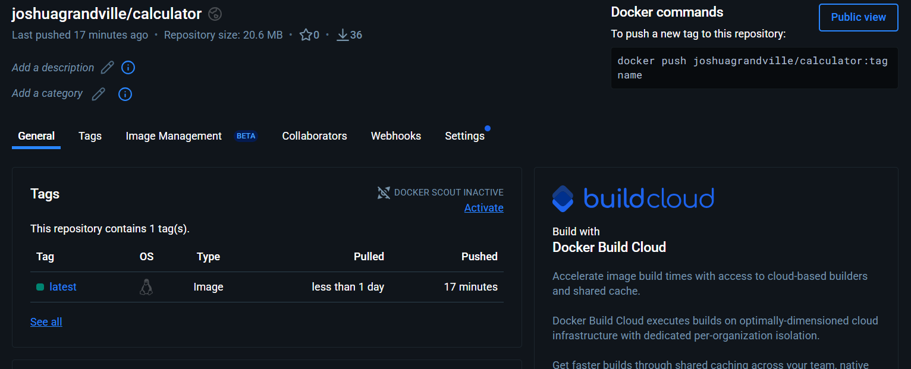

# CI-CD RAPORT

## Public GitHub repository URL

https://github.com/Pinappll/Projet-Securite-web.git

## Screenshot of CI pipeline passing in GitHub Actions

## Screenshot of CI pipeline passing in GitHub Actions

## Screenshot of your Docker Hub repository showing the image

